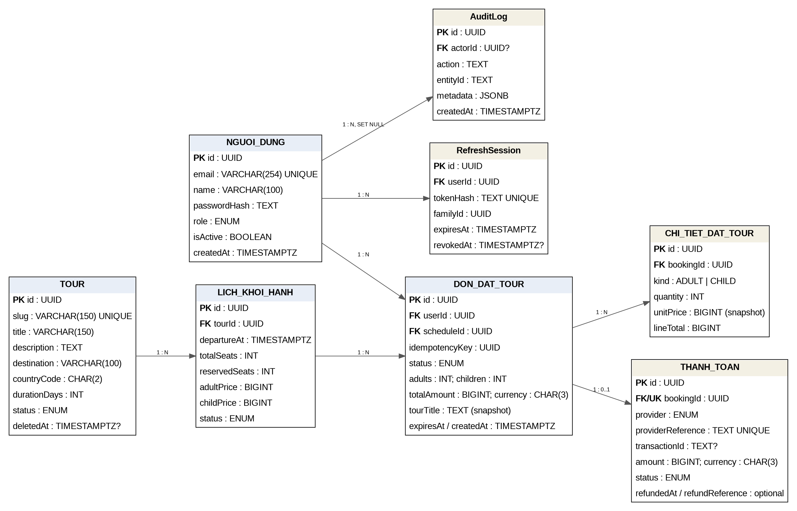
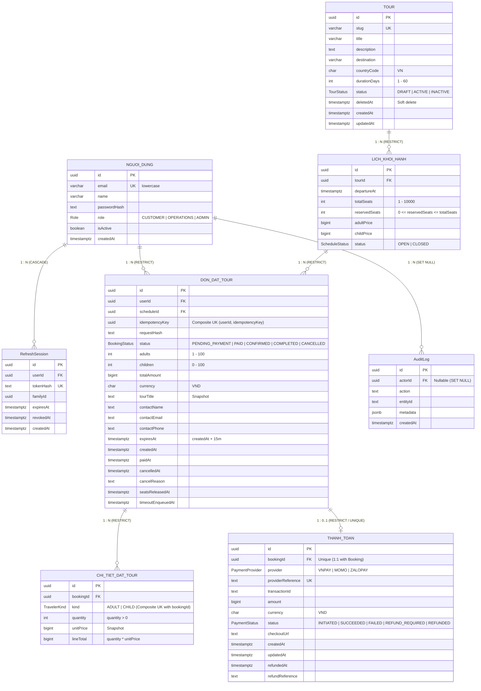

# 📘 TÀI LIỆU THIẾT KẾ CƠ SỞ DỮ LIỆU
## HỆ THỐNG QUẢNG BÁ VÀ ĐẶT TOUR DU LỊCH TRỰC TUYẾN

> **Tác giả:** Hồng Thắm  
> **Chủ đề:** Hệ thống CSDL Website Quảng bá và Đặt Tour Du lịch Nội địa Việt Nam  
> **Hệ quản trị CSDL hỗ trợ:** PostgreSQL & Microsoft SQL Server (T-SQL)  
> **Phiên bản tài liệu:** 1.0 (Tháng 09/2026)  

---

## 📑 MỤC LỤC

1. [Tổng quan Đề tài & Kiến trúc Hệ thống](#1-tổng-quan-đề-tài--kiến-trúc-hệ-thống)
2. [Cấu trúc Thư mục & Vai trò Tệp tin](#2-cấu-trúc-thư-mục--vai-trò-tệp-tin)
3. [Sơ đồ Thực thể Quan hệ (ERD - Entity Relationship Diagram)](#3-sơ-đồ-thực-thể-quan-hệ-erd)
4. [Từ điển Dữ liệu Chi tiết (Data Dictionary - 8 Bảng)](#4-từ-điển-dữ-liệu-chi-tiết-data-dictionary)
   - [4.1. Bảng NGUOI_DUNG (Tài khoản người dùng)](#41-bảng-nguoi_dung)
   - [4.2. Bảng RefreshSession (Phiên đăng nhập & Refresh Token)](#42-bảng-refreshsession)
   - [4.3. Bảng TOUR (Thông tin tour du lịch)](#43-bảng-tour)
   - [4.4. Bảng LICH_KHOI_HANH (Lịch khởi hành & Quản lý chỗ)](#44-bảng-lich_khoi_hanh)
   - [4.5. Bảng DON_DAT_TOUR (Đơn đặt tour & Giữ chỗ)](#45-bảng-don_dat_tour)
   - [4.6. Bảng CHI_TIET_DAT_TOUR (Chi tiết loại vé theo đơn)](#46-bảng-chi_tiet_dat_tour)
   - [4.7. Bảng THANH_TOAN (Giao dịch cổng thanh toán)](#47-bảng-thanh_toan)
   - [4.8. Bảng AuditLog / AUDIT_LOG (Nhật ký kiểm toán)](#48-bảng-auditlog--audit_log)
5. [Quy tắc Nghiệp vụ & Ràng buộc Toàn vẹn (Invariants & Hardening)](#5-quy-tắc-nghiệp-vụ--ràng-buộc-toàn-vẹn)
6. [Chiến lược Đánh Chỉ mục (Index Strategy)](#6-chiến-lược-đánh-chỉ-mục-index-strategy)
7. [Khung Lập trình CSDL: Views, Stored Procedures & Triggers](#7-khung-lập-trình-csdl-views-stored-procedures--triggers)
   - [7.1. Hệ thống Views](#71-hệ-thống-views)
   - [7.2. Stored Procedures](#72-stored-procedures)
   - [7.3. Triggers & Functions](#73-triggers--functions)
8. [So sánh Đối chiếu: PostgreSQL vs Microsoft SQL Server](#8-so-sánh-đối-chiếu-postgresql-vs-sql-server)
9. [Hướng dẫn Cài đặt & Triển khai Kịch bản SQL](#9-hướng-dẫn-cài-đặt--triển-khai-kịch-bản-sql)
10. [Tập Hợp Truy vấn Mẫu Phân tích & Báo cáo Nghiệp vụ](#10-tập-hợp-truy-vấn-mẫu-phân-tích--báo-cáo-nghiệp-vụ)

---

## 1. TỔNG QUAN ĐỀ TÀI & KIẾN TRÚC HỆ THỐNG

### 1.1. Bối cảnh & Mục tiêu
Ngành du lịch trực tuyến đòi hỏi tính toàn vẹn dữ liệu cực kỳ khắt khe: tình trạng **overbooking** (bán quá số chỗ thực tế), xung đột giao dịch khi nhiều khách cùng chọn chỗ vào một thời điểm, hoặc thất thoát thông tin giá vé khi tour thay đổi biểu giá.

Hệ thống Cơ sở dữ liệu **"Quảng bá và Đặt Tour Du lịch Trực tuyến"** được thiết kế bài bản theo các tiêu chuẩn công nghiệp:
- **Chuẩn hóa dữ liệu:** Đạt chuẩn 3NF (Third Normal Form) kết hợp kỹ thuật snapshot có chủ đích để bảo toàn lịch sử giao dịch kế toán.
- **Quản lý kho chỗ thời gian thực:** Cơ chế khóa tạm thời (Hold inventory) chính xác 15 phút qua trường `expiresAt`, tự động hoàn trả chỗ (`seatsReleasedAt`) khi quá hạn hoặc khách hủy đơn.
- **An toàn giao dịch:** Áp dụng `idempotencyKey` và `requestHash` để chống trùng lặp đơn hàng từ phía Client.
- **Bảo mật & Phiên:** Quản lý phiên xác thực `RefreshSession` theo mô hình Token Family Rotation chống tấn công replay.
- **Truy vết kiểm toán (Audit Trail):** Bảng `AuditLog` lưu lại mọi thay đổi nhạy cảm (thanh toán, đổi trạng thái tour, hủy đơn, khóa tài khoản) kèm `metadata` định dạng JSON.

### 1.2. Phạm vi Nghiệp vụ
- **Địa bàn khai thác:** Tour du lịch nội địa Việt Nam (`countryCode = 'VN'`).
- **Thời lượng tour:** Từ 1 đến 60 ngày.
- **Tiền tệ thanh toán:** Việt Nam Đồng (`VND`).
- **Cổng thanh toán hỗ trợ:** VNPAY, MOMO, ZALOPAY.

---

## 2. CẤU TRÚC THƯ MỤC & VAI TRÒ TỆP TIN

Trong thư mục hiện tại bao gồm các thành phần sau:

| Tên tệp tin | Định dạng | Mục đích & Mô tả |
| :--- | :--- | :--- |
| `01_Tao_CSDL_Bang.sql` | PostgreSQL Script | Tạo tiện ích mã hóa `pgcrypto`, định nghĩa 6 kiểu ENUM, tạo 8 bảng chính, hệ thống Indexes tối ưu hóa và 12 CHECK constraints ràng buộc nghiệp vụ. |
| `02_Them_Du_Lieu_Demo.sql` | PostgreSQL Script | Nạp dữ liệu mẫu hoàn chỉnh: người dùng (Admin, Ops, Khách), tour các miền, lịch trình khởi hành, các đơn hàng kèm chi tiết, hóa đơn thanh toán và audit logs. |
| `03_View_ThuTuc_Trigger_TruyVan.sql` | PostgreSQL Script | Tạo 4 Views báo cáo, 3 Stored Procedures quản trị, 3 Triggers tự động cập nhật thời gian và ghi vết thanh toán, cùng 10 câu truy vấn nghiệp vụ quan trọng. |
| `tour_booking_sqlserver.sql` | MS SQL Server Script | Bộ mã nguồn hoàn chỉnh tương đương được chuyển đổi sang chuẩn T-SQL cho Microsoft SQL Server (tạo DB, bảng, CHECK, dữ liệu 10 dòng/bảng, kiểm tra tính toàn vẹn). |
| `ERD_DATABASE.png` | Ảnh sơ đồ | Bản đồ trực quan mô hình Thực thể - Mối quan hệ (Entity-Relationship Diagram) của cơ sở dữ liệu. |
| `README.md` | Tài liệu Markdown | Bản đặc tả chi tiết toàn bộ thiết kế kiến trúc, từ điển dữ liệu, ràng buộc và hướng dẫn vận hành hệ thống. |

---

## 3. SƠ ĐỒ THỰC THỂ QUAN HỆ (ERD)

### 3.1. Hình ảnh Sơ đồ ERD
Sơ đồ ERD trực quan được kết xuất tại tệp [`ERD_DATABASE.png`](ERD_DATABASE.png):



### 3.2. Sơ đồ Quan hệ Dạng Mermaid
Dưới đây là sơ đồ chi tiết biểu diễn cấu trúc trường và mối liên kết giữa 8 bảng:



---

## 4. TỪ ĐIỂN DỮ LIỆU CHI TIẾT (DATA DICTIONARY)

Hệ thống bao gồm **8 bảng thực thể** được định nghĩa chi tiết dưới đây.

### 4.1. Bảng `NGUOI_DUNG`
Lưu trữ hồ sơ tài khoản truy cập hệ thống (Khách hàng, Nhân viên điều hành và Quản trị viên).

| Tên Cột | Kiểu (PG) | Kiểu (SQL Server) | Nullable | Khóa / Chỉ mục | Giá trị Mặc định | Ý nghĩa Nghiệp vụ |
| :--- | :--- | :--- | :---: | :---: | :--- | :--- |
| `id` | `UUID` | `UNIQUEIDENTIFIER` | ❌ No | **PK** | `gen_random_uuid()` / `NEWID()` | Định danh duy nhất người dùng. |
| `email` | `VARCHAR(254)` | `NVARCHAR(254)` | ❌ No | **UK** (`NGUOI_DUNG_email_key`) | Không | Email đăng nhập (buộc chữ thường). |
| `name` | `VARCHAR(100)` | `NVARCHAR(100)` | ❌ No | - | Không | Họ và tên người dùng. |
| `passwordHash` | `TEXT` | `NVARCHAR(MAX)` | ❌ No | - | Không | Chuỗi băm mật khẩu (Bcrypt / Argon2). |
| `role` | `ENUM Role` | `NVARCHAR(20)` | ❌ No | - | `'CUSTOMER'` | Phân quyền: `CUSTOMER`, `OPERATIONS`, `ADMIN`. |
| `isActive` | `BOOLEAN` | `BIT` | ❌ No | - | `TRUE` (`1`) | Trạng thái hoạt động (`TRUE` = mở, `FALSE` = khóa). |
| `createdAt` | `TIMESTAMPTZ(3)` | `DATETIME2(3)` | ❌ No | - | `CURRENT_TIMESTAMP` | Thời điểm khởi tạo tài khoản. |

---

### 4.2. Bảng `RefreshSession`
Quản lý phiên đăng nhập và cơ chế cấp mới mã truy cập (Refresh Token Rotation).

| Tên Cột | Kiểu (PG) | Kiểu (SQL Server) | Nullable | Khóa / Chỉ mục | Giá trị Mặc định | Ý nghĩa Nghiệp vụ |
| :--- | :--- | :--- | :---: | :---: | :--- | :--- |
| `id` | `UUID` | `UNIQUEIDENTIFIER` | ❌ No | **PK** | `gen_random_uuid()` / `NEWID()` | Định danh phiên đăng nhập. |
| `userId` | `UUID` | `UNIQUEIDENTIFIER` | ❌ No | **FK** -> `NGUOI_DUNG(id)` | Không | Tham chiếu tài khoản (CASCADE on DELETE). |
| `tokenHash` | `TEXT` | `NVARCHAR(MAX)` | ❌ No | **UK** | Không | Băm bảo mật của Refresh Token. |
| `familyId` | `UUID` | `UNIQUEIDENTIFIER` | ❌ No | **Index** (`userId, familyId`) | Không | Định danh chuỗi phiên xoay vòng Token. |
| `expiresAt` | `TIMESTAMPTZ(3)` | `DATETIME2(3)` | ❌ No | - | Không | Thời điểm hết hạn của Refresh Token. |
| `revokedAt` | `TIMESTAMPTZ(3)` | `DATETIME2(3)` | ✔️ Yes | - | `NULL` | Thời điểm thu hồi token (nếu bị đăng xuất/xâm nhập). |
| `createdAt` | `TIMESTAMPTZ(3)` | `DATETIME2(3)` | ❌ No | - | `CURRENT_TIMESTAMP` | Thời điểm phát hành phiên. |

---

### 4.3. Bảng `TOUR`
Lưu trữ danh mục các chương trình tour du lịch do doanh nghiệp cung cấp.

| Tên Cột | Kiểu (PG) | Kiểu (SQL Server) | Nullable | Khóa / Chỉ mục | Giá trị Mặc định | Ý nghĩa Nghiệp vụ |
| :--- | :--- | :--- | :---: | :---: | :--- | :--- |
| `id` | `UUID` | `UNIQUEIDENTIFIER` | ❌ No | **PK** | `gen_random_uuid()` / `NEWID()` | Định danh duy nhất của tour. |
| `slug` | `VARCHAR(150)` | `NVARCHAR(150)` | ❌ No | **UK** (`TOUR_slug_key`) | Không | Đường dẫn thân thiện SEO (duy nhất). |
| `title` | `VARCHAR(150)` | `NVARCHAR(150)` | ❌ No | - | Không | Tiêu đề chương trình tour. |
| `description` | `TEXT` | `NVARCHAR(MAX)` | ❌ No | - | Không | Nội dung giới thiệu, lộ trình chi tiết. |
| `destination` | `VARCHAR(100)` | `NVARCHAR(100)` | ❌ No | **Index** (`status, destination`) | Không | Tỉnh/thành phố hoặc điểm đến chính. |
| `countryCode` | `CHAR(2)` | `NCHAR(2)` | ❌ No | - | `'VN'` | Mã quốc gia ISO (Ràng buộc = `'VN'`). |
| `durationDays` | `INTEGER` | `INT` | ❌ No | - | Không | Số ngày đi tour (Ràng buộc từ 1 đến 60 ngày). |
| `status` | `ENUM TourStatus`| `NVARCHAR(20)` | ❌ No | **Composite Index** | `'DRAFT'` | Trạng thái: `DRAFT`, `ACTIVE`, `INACTIVE`. |
| `deletedAt` | `TIMESTAMPTZ(3)` | `DATETIME2(3)` | ✔️ Yes | **Composite Index** | `NULL` | Thời điểm xóa mềm (Soft-delete). |
| `createdAt` | `TIMESTAMPTZ(3)` | `DATETIME2(3)` | ❌ No | - | `CURRENT_TIMESTAMP` | Thời điểm tạo bản ghi. |
| `updatedAt` | `TIMESTAMPTZ(3)` | `DATETIME2(3)` | ❌ No | - | Không | Tự động cập nhật bởi Trigger. |

---

### 4.4. Bảng `LICH_KHOI_HANH`
Quản lý lịch xuất phát, số lượng chỗ và chính sách giá theo từng ngày cụ thể của tour.

| Tên Cột | Kiểu (PG) | Kiểu (SQL Server) | Nullable | Khóa / Chỉ mục | Giá trị Mặc định | Ý nghĩa Nghiệp vụ |
| :--- | :--- | :--- | :---: | :---: | :--- | :--- |
| `id` | `UUID` | `UNIQUEIDENTIFIER` | ❌ No | **PK** | `gen_random_uuid()` / `NEWID()` | Định danh lịch khởi hành. |
| `tourId` | `UUID` | `UNIQUEIDENTIFIER` | ❌ No | **FK** -> `TOUR(id)` | Không | Thuộc tour nào (RESTRICT on DELETE). |
| `departureAt` | `TIMESTAMPTZ(3)` | `DATETIME2(3)` | ❌ No | **Composite Index** | Không | Ngày giờ xe/tàu/máy bay xuất phát. |
| `totalSeats` | `INTEGER` | `INT` | ❌ No | - | Không | Tổng số lượng chỗ mở bán (1 đến 10,000). |
| `reservedSeats` | `INTEGER` | `INT` | ❌ No | - | `0` | Số chỗ đã đặt/giữ chỗ (`0 <= reserved <= total`). |
| `adultPrice` | `BIGINT` | `BIGINT` | ❌ No | - | Không | Đơn giá vé người lớn (VND). |
| `childPrice` | `BIGINT` | `BIGINT` | ❌ No | - | Không | Đơn giá vé trẻ em (VND). |
| `status` | `ENUM ScheduleStatus`| `NVARCHAR(10)` | ❌ No | **Composite Index** | `'OPEN'` | Trạng thái mở đặt: `OPEN`, `CLOSED`. |

---

### 4.5. Bảng `DON_DAT_TOUR`
Quản lý giao dịch đặt tour, trạng thái đơn, quy trình thanh toán và giữ chỗ tạm thời.

| Tên Cột | Kiểu (PG) | Kiểu (SQL Server) | Nullable | Khóa / Chỉ mục | Giá trị Mặc định | Ý nghĩa Nghiệp vụ |
| :--- | :--- | :--- | :---: | :---: | :--- | :--- |
| `id` | `UUID` | `UNIQUEIDENTIFIER` | ❌ No | **PK** | `gen_random_uuid()` / `NEWID()` | Mã đơn hàng đặt tour. |
| `userId` | `UUID` | `UNIQUEIDENTIFIER` | ❌ No | **FK** -> `NGUOI_DUNG(id)` | Không | Khách hàng thực hiện đặt đơn. |
| `scheduleId` | `UUID` | `UNIQUEIDENTIFIER` | ❌ No | **FK** -> `LICH_KHOI_HANH(id)` | Không | Lịch khởi hành được chọn. |
| `idempotencyKey`| `UUID` | `UNIQUEIDENTIFIER` | ❌ No | **Composite UK** (`userId, idempotencyKey`) | Không | Khóa tránh trùng lặp giao dịch từ Client. |
| `requestHash` | `TEXT` | `NVARCHAR(MAX)` | ❌ No | - | Không | Chữ ký băm nội dung request đặt phòng/tour. |
| `status` | `ENUM BookingStatus`| `NVARCHAR(20)` | ❌ No | **Composite Index** | `'PENDING_PAYMENT'` | `PENDING_PAYMENT`, `PAID`, `CONFIRMED`, `COMPLETED`, `CANCELLED`. |
| `adults` | `INTEGER` | `INT` | ❌ No | - | Không | Số lượng khách người lớn (1 - 100). |
| `children` | `INTEGER` | `INT` | ❌ No | - | `0` | Số lượng khách trẻ em (0 - 100). |
| `totalAmount` | `BIGINT` | `BIGINT` | ❌ No | - | Không | Tổng giá trị đơn hàng (VND). |
| `currency` | `CHAR(3)` | `NCHAR(3)` | ❌ No | - | `'VND'` | Đơn vị tiền tệ (mặc định và duy nhất VND). |
| `tourTitle` | `TEXT` | `NVARCHAR(MAX)` | ❌ No | - | Không | **Snapshot:** Tên tour tại thời điểm đặt (chống đổi tên sau này). |
| `contactName` | `TEXT` | `NVARCHAR(200)` | ❌ No | - | Không | Tên người liên hệ đại diện nhận vé. |
| `contactEmail` | `TEXT` | `NVARCHAR(254)` | ❌ No | - | Không | Email nhận hóa đơn điện tử / E-ticket. |
| `contactPhone` | `TEXT` | `NVARCHAR(20)` | ❌ No | - | Không | Số điện thoại liên lạc khẩn cấp. |
| `expiresAt` | `TIMESTAMPTZ(3)` | `DATETIME2(3)` | ❌ No | **Composite Index** | Không | Hạn giữ chỗ = `createdAt + 15 minutes`. |
| `createdAt` | `TIMESTAMPTZ(3)` | `DATETIME2(3)` | ❌ No | **Index** | `CURRENT_TIMESTAMP` | Thời điểm tạo đơn. |
| `paidAt` | `TIMESTAMPTZ(3)` | `DATETIME2(3)` | ✔️ Yes | - | `NULL` | Thời điểm ghi nhận thanh toán thành công. |
| `cancelledAt` | `TIMESTAMPTZ(3)` | `DATETIME2(3)` | ✔️ Yes | - | `NULL` | Thời điểm hủy đơn (nếu có). |
| `cancelReason` | `TEXT` | `NVARCHAR(MAX)` | ✔️ Yes | - | `NULL` | Lý do hủy đơn (bắt buộc khi hủy). |
| `seatsReleasedAt`| `TIMESTAMPTZ(3)` | `DATETIME2(3)` | ✔️ Yes | - | `NULL` | Thời điểm nhả chỗ về kho cho người khác mua. |
| `timeoutEnqueuedAt`| `TIMESTAMPTZ(3)` | `DATETIME2(3)` | ✔️ Yes | - | `NULL` | Thời điểm đưa vào hàng đợi kiểm tra timeout. |

---

### 4.6. Bảng `CHI_TIET_DAT_TOUR`
Bóc tách chi tiết thành phần số lượng vé người lớn/trẻ em cho từng đơn hàng.

| Tên Cột | Kiểu (PG) | Kiểu (SQL Server) | Nullable | Khóa / Chỉ mục | Giá trị Mặc định | Ý nghĩa Nghiệp vụ |
| :--- | :--- | :--- | :---: | :---: | :--- | :--- |
| `id` | `UUID` | `UNIQUEIDENTIFIER` | ❌ No | **PK** | `gen_random_uuid()` / `NEWID()` | Định danh dòng chi tiết. |
| `bookingId` | `UUID` | `UNIQUEIDENTIFIER` | ❌ No | **FK** -> `DON_DAT_TOUR(id)` | Không | Đơn đặt tour tương ứng. |
| `kind` | `ENUM TravelerKind`| `NVARCHAR(10)` | ❌ No | **Composite UK** (`bookingId, kind`) | Không | Phân loại vé: `ADULT` hoặc `CHILD`. |
| `quantity` | `INTEGER` | `INT` | ❌ No | - | Không | Số lượng hành khách loại này (> 0). |
| `unitPrice` | `BIGINT` | `BIGINT` | ❌ No | - | Không | **Snapshot:** Đơn giá vé tại thời điểm đặt. |
| `lineTotal` | `BIGINT` | `BIGINT` | ❌ No | - | Không | Thành tiền (`quantity * unitPrice`). |

---

### 4.7. Bảng `THANH_TOAN`
Giao dịch thanh toán trực tuyến qua các cổng trung gian tài chính.

| Tên Cột | Kiểu (PG) | Kiểu (SQL Server) | Nullable | Khóa / Chỉ mục | Giá trị Mặc định | Ý nghĩa Nghiệp vụ |
| :--- | :--- | :--- | :---: | :---: | :--- | :--- |
| `id` | `UUID` | `UNIQUEIDENTIFIER` | ❌ No | **PK** | `gen_random_uuid()` / `NEWID()` | Mã giao dịch trong hệ thống. |
| `bookingId` | `UUID` | `UNIQUEIDENTIFIER` | ❌ No | **FK** -> `DON_DAT_TOUR(id)` | Không | **UK:** 1 đơn tối đa 1 thanh toán chủ động. |
| `provider` | `ENUM PaymentProvider`| `NVARCHAR(10)` | ❌ No | **Composite UK** (`provider, transactionId`)| Không | Cổng thanh toán: `VNPAY`, `MOMO`, `ZALOPAY`. |
| `providerReference`| `TEXT` | `NVARCHAR(200)` | ❌ No | **UK** | Không | Mã tham chiếu gửi sang cổng giao dịch. |
| `transactionId`| `TEXT` | `NVARCHAR(200)` | ✔️ Yes | **Composite UK** | `NULL` | Mã giao dịch thực tế phía cổng trả về. |
| `amount` | `BIGINT` | `BIGINT` | ❌ No | - | Không | Số tiền thanh toán (VND). |
| `currency` | `CHAR(3)` | `NCHAR(3)` | ❌ No | - | `'VND'` | Đơn vị tiền tệ (VND). |
| `status` | `ENUM PaymentStatus`| `NVARCHAR(20)` | ❌ No | **Index** (`status, createdAt, id`) | `'INITIATED'` | `INITIATED`, `SUCCEEDED`, `FAILED`, `REFUND_REQUIRED`, `REFUNDED`. |
| `checkoutUrl` | `TEXT` | `NVARCHAR(MAX)` | ✔️ Yes | - | `NULL` | Đường dẫn redirect sang trang thanh toán. |
| `createdAt` | `TIMESTAMPTZ(3)` | `DATETIME2(3)` | ❌ No | **Index** | `CURRENT_TIMESTAMP` | Thời điểm bắt đầu giao dịch. |
| `updatedAt` | `TIMESTAMPTZ(3)` | `DATETIME2(3)` | ❌ No | - | Không | Cập nhật tự động bởi Trigger. |
| `refundedAt` | `TIMESTAMPTZ(3)` | `DATETIME2(3)` | ✔️ Yes | - | `NULL` | Thời điểm hoàn tiền thành công. |
| `refundReference`| `TEXT` | `NVARCHAR(200)` | ✔️ Yes | - | `NULL` | Mã tham chiếu lệnh hoàn tiền từ đối tác. |

---

### 4.8. Bảng `AuditLog` / `AUDIT_LOG`
Nhật ký kiểm toán hệ thống nhằm phục vụ mục đích bảo mật, truy vết điều tra và giám sát vận hành.

| Tên Cột | Kiểu (PG) | Kiểu (SQL Server) | Nullable | Khóa / Chỉ mục | Giá trị Mặc định | Ý nghĩa Nghiệp vụ |
| :--- | :--- | :--- | :---: | :---: | :--- | :--- |
| `id` | `UUID` | `UNIQUEIDENTIFIER` | ❌ No | **PK** | `gen_random_uuid()` / `NEWID()` | Định danh bản ghi log. |
| `actorId` | `UUID` | `UNIQUEIDENTIFIER` | ✔️ Yes | **FK** -> `NGUOI_DUNG(id)` | `NULL` | Người thực hiện hành động (NULL nếu là hệ thống). |
| `action` | `TEXT` | `NVARCHAR(100)` | ❌ No | - | Không | Tên hành động (`PAYMENT_STATUS_CHANGED`, `TOUR_CREATED`...). |
| `entityId` | `TEXT` | `NVARCHAR(200)` | ❌ No | **Index** (`entityId, createdAt`) | Không | Định danh thực thể bị tác động. |
| `metadata` | `JSONB` | `NVARCHAR(MAX)` | ❌ No | - | `'{}'` | Dữ liệu chi tiết dạng JSON (trạng thái cũ, mới, số tiền...). |
| `createdAt` | `TIMESTAMPTZ(3)` | `DATETIME2(3)` | ❌ No | **Index** (`createdAt, id`) | `CURRENT_TIMESTAMP` | Thời điểm diễn ra sự kiện. |

---

## 5. QUY TẮC NGHIỆP VỤ & RÀNG BUỘC TOÀN VẸN

CSDL này áp dụng **12 ràng buộc nghiệp vụ cấp cao (CHECK Constraints)** đảm bảo dữ liệu luôn hợp lệ ngay từ tầng lưu trữ database mà không phụ thuộc hoàn toàn vào code Backend:

1. **Ràng buộc Chuẩn hóa Email Người dùng (`user_email_lowercase`):**  
   - Biểu thức: `email = lower(email)` (trên PostgreSQL) hoặc `email = LOWER(email) COLLATE Latin1_General_BIN` (SQL Server).  
   - Mục đích: Đảm bảo tính nhất quán tuyệt đối khi tìm kiếm và đăng nhập, tránh việc tạo 2 tài khoản trùng lặp chỉ khác chữ hoa/thường.

2. **Ràng buộc Địa lý Nội địa (`tour_domestic`):**  
   - Biểu thức: `countryCode = 'VN'`.  
   - Mục đích: Hệ thống chuyên biệt cho thị trường du lịch nội địa Việt Nam.

3. **Ràng buộc Độ dài Tour (`tour_duration`):**  
   - Biểu thức: `durationDays BETWEEN 1 AND 60`.  
   - Mục đích: Ngăn chặn lỗi nhập liệu thời gian âm hoặc tour dài bất thường trên 2 tháng.

4. **Ràng buộc Quản lý Kho chỗ (`valid_inventory`):**  
   - Biểu thức: `totalSeats BETWEEN 1 AND 10000 AND reservedSeats >= 0 AND reservedSeats <= totalSeats`.  
   - Mục đích: Triệt tiêu hoàn toàn nguy cơ **Overbooking**; số lượng chỗ giữ luôn nằm trong giới hạn cho phép.

5. **Ràng buộc Giới hạn Đơn giá Tour (`valid_prices`):**  
   - Biểu thức: `adultPrice BETWEEN 0 AND 99999999 AND childPrice BETWEEN 0 AND 99999999`.  
   - Mục đích: Kiểm soát biên độ giá tour không vượt quá 100 triệu VND/vé và không được âm.

6. **Ràng buộc Quy mô Đoàn Khách (`valid_party`):**  
   - Biểu thức: `adults BETWEEN 1 AND 100 AND children BETWEEN 0 AND 100`.  
   - Mục đích: Mỗi đơn bắt buộc phải có ít nhất 1 người lớn chịu trách nhiệm pháp lý; giới hạn tối đa 100 người/đoàn trực tuyến.

7. **Ràng buộc Tiền tệ và Giới hạn Đơn (`valid_total` & `valid_payment_amount`):**  
   - Biểu thức: `totalAmount BETWEEN 0 AND 9999999999 AND currency = 'VND'`.  
   - Mục đích: Cố định đơn vị tính là VND, kiểm soát tổng thanh toán tối đa 10 tỷ VND/đơn.

8. **Ràng buộc Giữ chỗ Đúng 15 Phút (`exact_hold`):**  
   - Biểu thức: `expiresAt = createdAt + INTERVAL '15 minutes'` (PG) / `DATEADD(MINUTE, 15, createdAt)` (SQL Server).  
   - Mục đích: Chính sách khoá chỗ tạm để khách thanh toán. Quá 15 phút chưa trả tiền, worker quét và giải phóng chỗ cho khách khác.

9. **Ràng buộc Tính Nhất quán khi Hủy đơn (`cancel_fields_match_status` & `release_matches_cancel`):**  
   - Biểu thức: `(status = 'CANCELLED') = (cancelledAt IS NOT NULL AND cancelReason IS NOT NULL AND seatsReleasedAt IS NOT NULL)`.  
   - Mục đích: Một đơn chỉ được đánh dấu là CANCELLED nếu và chỉ nếu ghi nhận đầy đủ: ngày hủy, lý do hủy và thời điểm nhả chỗ.

10. **Ràng buộc Tính Toàn vẹn Dòng Hóa đơn Chi tiết (`valid_detail`):**  
    - Biểu thức: `quantity > 0 AND unitPrice >= 0 AND lineTotal = quantity * unitPrice`.  
    - Mục đích: Đảm bảo số lượng dương, đơn giá không âm và tổng tiền của từng dòng chi tiết phải khớp chính xác với phép nhân số lượng * đơn giá.

11. **Ràng buộc Tính Nhất quán khi Hoàn tiền (`refund_fields_match_status`):**  
    - Biểu thức: `(status = 'REFUNDED') = (refundedAt IS NOT NULL AND refundReference IS NOT NULL)`.  
    - Mục đích: Tránh việc ghi nhận trạng thái REFUNDED mà không có bằng chứng mã tham chiếu giao dịch hoàn tiền từ ngân hàng/cổng thanh toán.

12. **Cơ chế Snapshot bảo toàn Lịch sử:**  
    - Trường `tourTitle` trong `DON_DAT_TOUR` và trường `unitPrice` trong `CHI_TIET_DAT_TOUR` là các trường snapshot. Kể cả khi người quản trị sửa tên tour hoặc tăng giá tour trong tương lai, hóa đơn đã xuất của khách hàng vẫn bảo toàn giá trị tại thời điểm mua.

---

## 6. CHIẾN LƯỢC ĐÁNH CHỈ MỤC (INDEX STRATEGY)

Để đáp ứng tải truy cập đồng thời cao và tối ưu hóa thời gian thực thi của các Worker quét ngầm (Background Jobs), hệ thống triển khai các nhóm chỉ mục sau:

| Tên Chỉ mục (Index Name) | Bảng Tác động | Cột Đánh Chỉ mục | Mục đích Tối ưu hóa |
| :--- | :--- | :--- | :--- |
| `NGUOI_DUNG_email_key` | `NGUOI_DUNG` | `email` (UNIQUE) | Tra cứu đăng nhập tức thì O(1), ngăn email trùng. |
| `TOUR_slug_key` | `TOUR` | `slug` (UNIQUE) | Tối ưu hóa tốc độ tải trang chi tiết tour theo URL Slug. |
| `TOUR_status_countryCode_deletedAt_createdAt_id_idx` | `TOUR` | `status, countryCode, deletedAt, createdAt, id` | Phục vụ truy vấn danh sách tour công khai với phân trang Keyset/Cursor Pagination. |
| `LICH_KHOI_HANH_tourId_departureAt_idx` | `LICH_KHOI_HANH` | `tourId, departureAt` | Lọc danh sách ngày khởi hành của một tour theo thứ tự thời gian. |
| `DON_DAT_TOUR_status_expiresAt_idx` | `DON_DAT_TOUR` | `status, expiresAt` | **Index cực kỳ quan trọng cho Worker:** Quét các đơn `PENDING_PAYMENT` đã quá hạn để tự động hủy và hoàn trả chỗ kho. |
| `DON_DAT_TOUR_scheduleId_status_idx` | `DON_DAT_TOUR` | `scheduleId, status` | Tối ưu hóa việc tổng hợp đếm số chỗ thực tế đang bị giữ trên mỗi chuyến đi. |
| `DON_DAT_TOUR_userId_idempotencyKey_key` | `DON_DAT_TOUR` | `userId, idempotencyKey` (UNIQUE) | Triệt tiêu lỗi người dùng ấn nút Đặt tour 2 lần liên tiếp do lag mạng (Idempotency). |
| `DON_DAT_TOUR_userId_createdAt_id_idx` | `DON_DAT_TOUR` | `userId, createdAt, id` | Tối ưu màn hình "Lịch sử đặt tour của tôi" trong trang cá nhân khách hàng. |
| `CHI_TIET_DAT_TOUR_bookingId_kind_key` | `CHI_TIET_DAT_TOUR` | `bookingId, kind` (UNIQUE) | Đảm bảo 1 đơn chỉ có tối đa 1 dòng cho người lớn và 1 dòng cho trẻ em. |
| `THANH_TOAN_bookingId_key` | `THANH_TOAN` | `bookingId` (UNIQUE) | Ràng buộc quan hệ 1 - 1 giữa Đơn đặt tour và Giao dịch thanh toán chủ động. |
| `THANH_TOAN_status_createdAt_id_idx` | `THANH_TOAN` | `status, createdAt, id` | Quét các giao dịch cần đối soát hoàn tiền (`REFUND_REQUIRED`). |
| `AuditLog_entityId_createdAt_idx` | `AuditLog` | `entityId, createdAt` | Truy xuất toàn bộ lịch sử biến động của một Tour/Đơn hàng/Người dùng cụ thể. |

---

## 7. KHUNG LẬP TRÌNH CSDL: VIEWS, STORED PROCEDURES & TRIGGERS

Hệ thống được trang bị các đối tượng thủ tục và khung nhìn tự động hóa (được hiện thực đầy đủ tại tệp `03_View_ThuTuc_Trigger_TruyVan.sql`):

### 7.1. Hệ thống Views
1. **`vw_TourActive`:** Trích xuất toàn bộ các tour đang ở trạng thái `ACTIVE` và chưa bị xóa mềm (`deletedAt IS NULL`). Dành riêng cho Frontend hiển thị trang chủ và trang danh mục.
2. **`vw_ScheduleAvailable`:** Danh sách các chuyến đi còn chỗ (`reservedSeats < totalSeats`), thời gian khởi hành trong tương lai (`departureAt > NOW()`) và thuộc các tour đang hoạt động. Tính sẵn cột `availableSeats = totalSeats - reservedSeats`.
3. **`vw_BookingInfo`:** View nghiệp vụ toàn diện kết hợp 4 bảng (`DON_DAT_TOUR`, `NGUOI_DUNG`, `TOUR`, `LICH_KHOI_HANH`, `THANH_TOAN`), hiển thị trọn vẹn thông tin khách đặt, số vé, trạng thái đơn và chi tiết thanh toán.
4. **`vw_TourRevenue`:** Thống kê tổng hợp doanh thu theo từng chương trình tour, chỉ tính các đơn hàng thành công (`PAID`, `CONFIRMED`, `COMPLETED`) và giao dịch thanh toán thành công (`SUCCEEDED`).

### 7.2. Stored Procedures
- **`sp_DeactivateUser(p_user_id UUID)`:** Thủ tục khóa tài khoản người dùng vi phạm điều khoản (`isActive = FALSE`), có kiểm tra phát hiện lỗi không tìm thấy người dùng.
- **`sp_CloseSchedule(p_schedule_id UUID)`:** Thủ tục đóng bán vé của một lịch khởi hành (`status = 'CLOSED'`) khi đã chốt danh sách đoàn.
- **`sp_ArchiveTour(p_tour_id UUID)`:** Thủ tục lưu trữ/ngừng kinh doanh một tour thông qua kỹ thuật xóa mềm (`status = 'INACTIVE'`, `deletedAt = NOW()`).

### 7.3. Triggers & Functions
1. **`trg_TouchTourUpdatedAt` & `fn_TouchTourUpdatedAt`:** Tự động gán `updatedAt = CURRENT_TIMESTAMP` mỗi khi bảng `TOUR` phát sinh thao tác `UPDATE`.
2. **`trg_TouchPaymentUpdatedAt` & `fn_TouchPaymentUpdatedAt`:** Tự động gán `updatedAt = CURRENT_TIMESTAMP` trên bảng `THANH_TOAN` khi trạng thái hoặc dữ liệu giao dịch cập nhật.
3. **`trg_AuditPaymentStatusChange` & `fn_AuditPaymentStatusChange`:** Trigger tự động kích hoạt sau khi `THANH_TOAN` được cập nhật. Nếu trường `status` thay đổi, hệ thống sẽ tự động chèn một dòng vào `AuditLog` với `action = 'PAYMENT_STATUS_CHANGED'` và đóng gói thông tin cũ/mới dạng JSON Object vào cột `metadata`.

---

## 8. SO SÁNH ĐỐI CHIẾU: POSTGRESQL VS SQL SERVER

Hệ thống được cung cấp với cả 2 phiên bản phổ biến nhất hiện nay: PostgreSQL (mã nguồn mở, phù hợp Microservices / Cloud Native) và Microsoft SQL Server (doanh nghiệp lớn / T-SQL).

| Đặc tả Kỹ thuật | PostgreSQL (`01_Tao_CSDL_Bang.sql`) | Microsoft SQL Server (`tour_booking_sqlserver.sql`) |
| :--- | :--- | :--- |
| **Kiểu Khóa chính (UUID)** | `UUID` (hỗ trợ native qua module `pgcrypto`) | `UNIQUEIDENTIFIER` |
| **Hàm sinh ID tự động** | `gen_random_uuid()` | `NEWID()` |
| **Tập giá trị Enums** | `CREATE TYPE ... AS ENUM ('...')` | Dùng `NVARCHAR` kết hợp `CHECK (col IN ('...'))` |
| **Chuỗi ký tự Unicode** | `VARCHAR`, `TEXT` (mặc định hỗ trợ UTF-8) | `NVARCHAR(n)`, `NVARCHAR(MAX)` (tiền tố `N'...'`) |
| **Kiểu Thời gian có Múi giờ** | `TIMESTAMPTZ(3)` (độ chính xác mili-giây) | `DATETIME2(3)` kết hợp múi giờ ứng dụng |
| **Kiểu Đúng/Sai (Boolean)** | `BOOLEAN` (`TRUE` / `FALSE`) | `BIT` (`1` / `0`) |
| **Dữ liệu Phi cấu trúc JSON** | `JSONB` (hỗ trợ Index GIN, truy vấn key/value siêu tốc) | `NVARCHAR(MAX)` kết hợp các hàm `JSON_VALUE`, `ISJSON` |
| **Tính toán Thời gian (Hold)** | `createdAt + INTERVAL '15 minutes'` | `DATEADD(MINUTE, 15, createdAt)` |
| **Cập nhật Timestamp tự động** | Dùng Trigger `BEFORE UPDATE` gắn `NEW.updatedAt = NOW()` | Dùng Trigger `INSTEAD OF UPDATE` hoặc Trigger `AFTER UPDATE` |
| **Xử lý Xung đột Chèn** | Cú pháp `ON CONFLICT (col) DO NOTHING` | Dùng lệnh `IF NOT EXISTS(...) INSERT...` hoặc `MERGE` |

---

## 9. HƯỚNG DẪN CÀI ĐẶT & TRIỂN KHAI KỊCH BẢN SQL

### 9.1. Hướng dẫn Triển khai trên PostgreSQL
Mở công cụ **pgAdmin 4**, **DBeaver** hoặc chạy bằng dòng lệnh `psql`. Thực thi tuần tự 3 tệp tin theo đúng thứ tự sau:

```bash
# Bước 1: Khởi tạo tiện ích, kiểu dữ liệu, các bảng, chỉ mục và ràng buộc
psql -U postgres -d tour_database -f "01_Tao_CSDL_Bang.sql"

# Bước 2: Nạp dữ liệu mẫu thử nghiệm (Tours, Lịch khởi hành, Khách hàng, Đơn đặt, Giao dịch)
psql -U postgres -d tour_database -f "02_Them_Du_Lieu_Demo.sql"

# Bước 3: Biên dịch Views, Stored Procedures, Triggers và kiểm tra truy vấn
psql -U postgres -d tour_database -f "03_View_ThuTuc_Trigger_TruyVan.sql"
```

> [!NOTE]
> File `01_Tao_CSDL_Bang.sql` cần quyền siêu người dùng (superuser) hoặc quyền cài đặt extension để thực thi câu lệnh: `CREATE EXTENSION IF NOT EXISTS pgcrypto;`.

---

### 9.2. Hướng dẫn Triển khai trên Microsoft SQL Server
Sử dụng công cụ **SQL Server Management Studio (SSMS)** hoặc **Azure Data Studio**:

1. Mở tệp tin [`tour_booking_sqlserver.sql`](tour_booking_sqlserver.sql).
2. Tệp tin đã được viết nguyên khối (All-in-one script):
   - **Phần 0:** Tạo mới cơ sở dữ liệu `TourBookingDB`.
   - **Phần 1:** Tạo đầy đủ 8 bảng kèm toàn bộ khóa chính, khóa ngoại, kiểm tra CHECK và chỉ mục INDEX.
   - **Phần 2:** Nạp 10 dòng dữ liệu mẫu chuẩn cho từng bảng (Tổng cộng 80 bản ghi mẫu chi tiết).
   - **Phần 3:** Câu lệnh kiểm tra số lượng bản ghi và danh sách bảng đã tạo.
3. Bấm **Execute** (`F5`) để chạy toàn bộ kịch bản.

---

## 10. TẬP HỢP TRUY VẤN MẪU PHÂN TÍCH & BÁO CÁO NGHIỆP VỤ

Dưới đây là một số truy vấn mẫu phục vụ việc vận hành và phân tích số liệu:

### 10.1. Báo cáo Doanh thu Thực thu theo Từng Tour
Liệt kê các tour có phát sinh doanh thu từ các đơn hàng thành công:

```sql
SELECT 
    t."id" AS "tourId",
    t."title" AS "tourTitle",
    t."destination",
    COUNT(DISTINCT b."id") AS "paidBookingCount",
    COALESCE(SUM(p."amount"), 0) AS "totalRevenue"
FROM "TOUR" t
JOIN "LICH_KHOI_HANH" s ON s."tourId" = t."id"
JOIN "DON_DAT_TOUR" b ON b."scheduleId" = s."id"
JOIN "THANH_TOAN" p ON p."bookingId" = b."id"
WHERE b."status" IN ('PAID', 'CONFIRMED', 'COMPLETED')
  AND p."status" = 'SUCCEEDED'
GROUP BY t."id", t."title", t."destination"
ORDER BY "totalRevenue" DESC;
```

### 10.2. Truy vấn Kiểm tra Chỗ trống Thực tế của Các Chuyến đi Sắp Khởi hành
Giúp bộ phận Điều hành theo dõi công suất ghế và tình trạng mở bán:

```sql
SELECT
    s."id" AS "scheduleId",
    t."title" AS "tourTitle",
    t."destination",
    s."departureAt",
    s."totalSeats",
    s."reservedSeats",
    (s."totalSeats" - s."reservedSeats") AS "availableSeats",
    s."adultPrice",
    s."status"
FROM "LICH_KHOI_HANH" s
JOIN "TOUR" t ON t."id" = s."tourId"
WHERE s."departureAt" > CURRENT_TIMESTAMP
  AND s."status" = 'OPEN'
ORDER BY s."departureAt" ASC;
```

### 10.3. Truy vấn Phát hiện Đơn Treo Giữ Chỗ Quá Hạn (Dành cho Background Job)
Tìm các đơn hàng đang ở trạng thái `PENDING_PAYMENT` nhưng đã vượt quá 15 phút chưa thanh toán:

```sql
SELECT 
    b."id" AS "expiredBookingId",
    b."scheduleId",
    (b."adults" + b."children") AS "seatsToRelease",
    b."createdAt",
    b."expiresAt"
FROM "DON_DAT_TOUR" b
WHERE b."status" = 'PENDING_PAYMENT'
  AND b."expiresAt" < CURRENT_TIMESTAMP;
```

### 10.4. Truy vết Lịch sử Kiểm toán Thay đổi Giao dịch Thanh toán
Giúp kiểm tra xem thanh toán nào đã bị thay đổi trạng thái, ai thực hiện và metadata ghi nhận:

```sql
SELECT 
    a."id" AS "auditId",
    a."entityId" AS "paymentId",
    a."action",
    a."metadata"->>'oldStatus' AS "oldStatus",
    a."metadata"->>'newStatus' AS "newStatus",
    a."metadata"->>'amount' AS "amount",
    a."createdAt"
FROM "AuditLog" a
WHERE a."action" = 'PAYMENT_STATUS_CHANGED'
ORDER BY a."createdAt" DESC;
```

---

> [!TIP]
> **Đóng góp & Mở rộng:** Khi tích hợp thêm các dịch vụ bổ sung như phòng khách sạn, vé máy bay riêng lẻ hoặc đánh giá nhận xét (Reviews), nên tạo bảng mới liên kết khóa ngoại với `TOUR(id)` hoặc `DON_DAT_TOUR(id)` mà không cần thay đổi cấu trúc cốt lõi hiện có.
